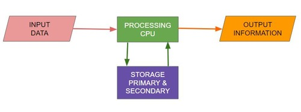
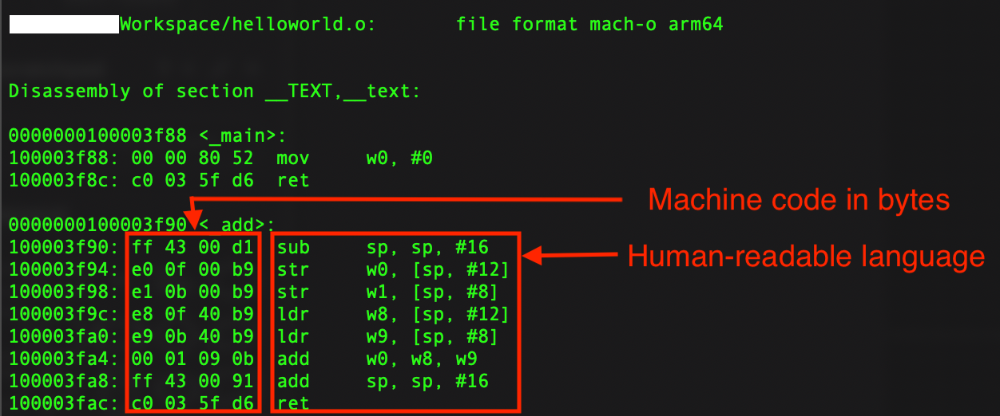
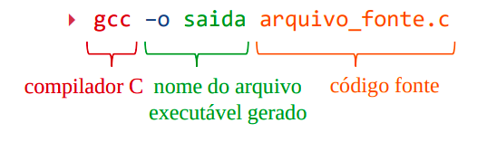
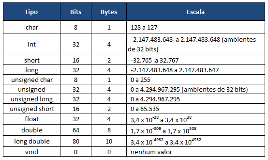
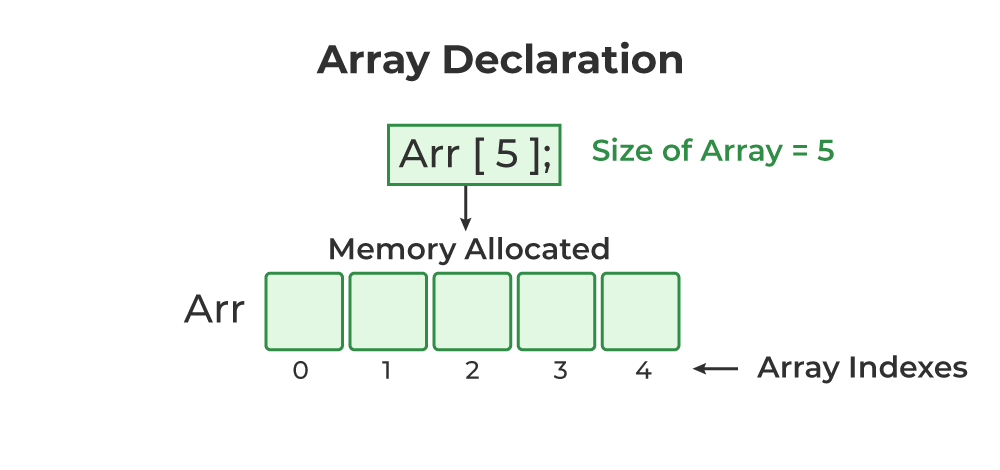

# Capacitação de Lógica - C
Capacitação de lógica de programação aplicada à Linguagem C - By Ex-Machina

# Parte 1

## Lógica de Programação

**<dt>Lógica</dt>** <dd>A ciência do raciocínio / pensamento.</dd>

O estudo da Computação surgiu como um ramo da Engenharia Elétrica que evoluiu junto com o desenvolvimento de novas tecnologias de hardware para atender às necessidades humanas de **efetuar cálculos** e **automatizar operações**. Com os avanços, tornou-se uma área distinta, que se especializou no desenvolvimento de **sistemas** que, em conjunto, executam **operações lógicas** para atingir  determinado resultado. Nesse sentido, ela sempre combina a lógica (**software**) com um meio físico (**hardware**) para operar. Em virtude disso, o funcionamento de qualquer dispositivo eletrônico &mdash; e, consequentemente, sua **programação** &mdash; está atrelado fundamentalmente às leis da Física e seguem, portanto, uma **base lógica comum**.  

É justamente dessa base comum, aplicada à **linguagem C**, que vamos tratar na capacitação de lógica; uma noção específica, mas que pode ser traduzida para **qualquer linguagem de programação**, respeitando suas regras.

**<dt>Programa</dt>** <dd>Lista de execução (ou **sequência cronológica**) das partes que compõe um espetáculo, concerto, cerimônia.</dd>

Essa definição poética do Google nos dá uma ideia do que pode ser o significado desse vocabulário no contexto da computação; uma **implementação específica** de um **algoritmo** &mdash; uma série de **instruções ordenadas** que executam **operações lógicas** &mdash; possivelmente incluindo a adição de outros elementos (estilização, IHC, armazenamento, etc.)

## Linguagem C

### 1. Introdução
C é uma linguagem de programação estruturada projetada para ser legível e econômica, criada nos anos 70, voltada para sistemas e aplicações que exigem alta performance e controle de hardware.
- É a base de muitas linguagens modernas (C++, Java, Go, Javascript, etc.).
- Muito utilizada em sistemas embarcados, com microcontroladores (Arduino, ESP32, STM32, PIC, etc) devido ao alto controle de memória que oferece, permitindo a otimização do uso de recursos limitados no contexto embarcado.

### Características
- Linguagem compilada &rarr; portável
- Permite manipulação de memória (ponteiros)
- Baixo nível &rarr; próximo ao hardware

---

### 2. Conceitos básicos

### 2.1 Processamento de Dados

O Processamento de dados se dá em **3 etapas** principais e distintas:

- **Entrada** (dados) &rarr; **Processamento** (algoritmo) &rarr; **Saída** (ação, exibição)

Ex.: No contexto de embarcados (prótese):

- Sensores &rarr; Microcontrolador (ESP32) &rarr; Atuadores (motores)




Obs.: Nos microcontroladores, os pinos de entrada e saída de sinais elétricos são chamados de **portas I/O** (Inputs & Outputs)

### 2.2 Criação de um código em C

Um código em linguagem C é um arquivo de texto com a extensão `.c`.

Tal arquivo pode ser criado por qualquer editor de texto comum, bastando digitar, no salvamento do arquivo, a extensão `.c` ao final.

### 2.3 Compilação



Códigos de máquina são naturalmente difíceis de ler, pois são extensos e pouco intuitivos. **Linguagens de programação** são **abstrações** de nível mais alto que o hardware que **padronizam uma sintaxe** que **facilita a leitura e escrita** de código. No entanto, tais linguagens não são diretamente compreendidas pelo processador, de modo que precisam ser traduzidas para um **arquivo executável** (em código binário). Esse processo recebe o nome de **compilação** de código.

Cada **CPU** (*Central Processing Unit* - Processador) possui um **conjunto de instruções distinto** baseado na **arquitetura** de seu circuito interno. Dessa forma, é conveniente um programa que conheça as diferentes variações de CPUs e seja capaz de gerar o arquivo correto para execução. Esse programa tradutor chamamos de **compilador**.

Para a Linguagem C, o compilador comumente usado é o GCC, que pode ser baixado juntamente com o programa MinGW para Windows ou através do comando `sudo apt install build-essential` no Linux (versões baseadas em Ubuntu) 

Para compilar um código em C, basta abrir o terminal na pasta em que o arquivo se encontra e executar o seguinte comando:

`gcc –o saida arquivo_fonte.c`

Esse comando cria um arquivo binário executável na mesma pasta em que o arquivo fonte. Sua estrutura está explicada abaixo:



### 2.4 IDEs

Para poupar-nos do trabalho de compilador código manualmente via terminal, dentre diversas outras atividades repetitivas que um programador raiz executava, foram criadas as **IDEs - *Integrated Development Environment* - ambientes de desenvolvimento integrado** que consistem em um editor de texto com uma série de funções extras. Para nossa capacitação utilizaremos o **VSCode** que inclui:
- reconhecimento de sintaxe de linguagens
    - coloração de termos (e temas!) 
    - correção de sintaxe e sugestões
    - identação automática
- interface com compiladores e *debuggers*
- terminal integrado
- controle de versionamento
- ferramentas colaborativas


### 2.5 Estrutura de um programa em C

Os programas em C seguem uma **estrutura padronizada**, que pode ser resumida da seguinte forma:
1. Inclusões (bibliotecas)
2. Diretivas de Pré-Processamento (constantes)
3. Estruturas e Enums (tipos definidos pelo usuário)
4. Funções (protótipos/declarações)
5. Main (função principal)

    6. Variáveis locais
    7. Chamadas de funções
    8. Retorno


Esqueleto:

```c
#include // Bibliotecas
#define // Diretivas

// Estruturas
// Funções

int main() { // Função principal
    
    /* Código Principal
        Variáveis Locais
        Chamadas de Funções
    */

    return 0; // Finalização do programa
}
```

### 3. Variáveis

**Variáveis** são **espaços de memória** que guardam valores. Como o nome sugere, esses valores podem ser variados, ou seja, **alterados**. Dessa forma, podem ser usadas como **parâmetros** para controlar um programa, como **memória** para guardar resultados de operações algébricas ou booleanas, etc.

Ao criar uma variável em C, precisamos declarar seu **tipo**. 

Os **tipos de dados** padrões da linguagem C são os seguintes:

| Tipo    | Descrição              | Exemplo      |
|---------|------------------------|--------------|
| int     | Inteiro                | 10           |
| float   | Ponto flutuante        | 3.14159      |
| double  | Ponto flutuante duplo  | 3.141592653  |
| char    | Caractere              | 'E'          |


---
#### Passo a passo de criação de variáveis:
- Declarar o tipo
- Dar um nome
- Passar o valor
- Finalizar com ponto-e-vírgula (;)


```c
int idade = 20;
float altura = 1.75;
char letra = 'E';
```
 --- 

Observe que cada tipo guarda informações diferentes e, portanto, tem um **tamanho de memória** específico para isso. Por isso, o uso dos tipos corretos impacta diretamente a eficiência de armazenamento dos dados. 

Abaixo, temos uma tabela completa para consulta:



Observe que o modificador `unsigned` pode ser usado para ignorar o bit da memória que que indica o **sinal numérico** da variável, passando a ser utilizado como bit quantitativo, concedendo, assim, mais espaço para se trabalhar com **valores unicamente positivos**.

Outra curiosidade é que os caracteres (`char`) também são guardados, na memória, na forma de 1s e 0s. Ao serem exibidos, eles são convertidos em um caracter (símbolo linguístico) através de uma tabela padronizada, conhecida como **Tabela ASCII**
### 4. Operadores

Muito semelhante ao conceito matemático, em programação os operadores são símbolos que executam operações básicas predefinidas com valores e variáveis.

### 4.1 Aritméticos:
São operadores conhecidos da matemática: `+`, `-`, `*`, `/`

Também inclui o operador módulo `%`, que obtém o **resto da divisão** entre 2 valores.

```c
#include <stdio.h>

int main() {
    int a = 10, b = 3;

    printf("Adição: %d\n", a + b);       // 13
    printf("Subtração: %d\n", a - b);    // 7
    printf("Multiplicação: %d\n", a * b); // 30
    printf("Divisão: %d\n", a / b);       // 3
    printf("Módulo: %d\n", a % b);        // 1

    return 0;
}

```

### 4.2 Relacionais:
Também chamados de **comparadores**, são operadores que retornam o valor **1** se a comparação feita for **verdade** e **0** se **falsa**.


São eles: `==`, `!=`, `<`, `>`, `<=`, `>=`

```c
#include <stdio.h>

int main() {
    int x = 5, y = 10;

    printf("x == y: %d\n", x == y);  // 0 (false)
    printf("x != y: %d\n", x != y);  // 1 (true)
    printf("x < y: %d\n", x < y);    // 1
    printf("x > y: %d\n", x > y);    // 0
    printf("x <= y: %d\n", x <= y);  // 1
    printf("x >= y: %d\n", x >= y);  // 0

    return 0;
}
```

### 4.3 Lógicos:
São operadores que trabalham com a lógica booleana (verdadeiro / falso).

#### Operador "E": `&&`
Compara 2 valores e retorna 1 (verdadeiro) apenas se ambos os valores são verdadeiros

#### Operador "OU": `||`
Compara 2 valores e retorna 1 (verdadeiro) se qualquer um dos valores são verdadeiros

#### Operador "Negação": `!`
Retorna o valor invertido da expressão à sua frente

```c
#include <stdio.h>

int main() {
    int a = 1, b = 0;

    printf("a && b: %d\n", a && b);  // 0
    printf("a || b: %d\n", a || b);  // 1
    printf("!a: %d\n", !a);          // 0
    printf("!b: %d\n", !b);          // 1

    return 0;
}
```

### 4.4 Atribuição:

Consiste no operador básico `=`, que atribui um valor a uma variável. Esse operador pode ser combinado com os aritméticos, de forma que ele passa a guardar o resultado final da operação na variável. Abaixo, um exemplo:
```c
#include <stdio.h>

int main() {
    int x = 10;

    x += 5; //após essa linha, x vale 15
    x -= 3; //após essa linha, x vale 12
    x *= 2; //após essa linha, x vale 24
    x /= 4; //após essa linha, x vale 6
    x %= 5; //após essa linha, x vale 1

    printf("Valor final de x: %d\n", x);  //Valor final de x: 1

    return 0;
}
```

#### 4.5 Incremento e Decremento:

São 2 operadores comumente usados para aumentar em 1 unidade o valor de uma variável e salvá-lo. Sua aplicação mais classica são contadores, como a variável de controle usada na criação do loop **for**.

| Operador | Descrição | Equivalente |
| -------- | ----------- | ----------- |
| `++`     | Increment   | += 1        |
| `--`     | Decrement   | += 1        |


Exemplo básico:
```c
#include <stdio.h>

int main() {
    int i = 3;
    i++;
    printf("Resultado - i vale: %d\n", i);    
    //Resultado - i vale: 4

    return 0;
}
```

Um detalhe é que, se esse operador for utilizado antes da variável, ele incrementa o valor antes dela ser usada. Se for utilizado depois, ele só incrementa após o uso da variável. Observe:
```c
int x = 3; // definimos a variável x com valor 3
printf("%d\n", ++x);  // mostra 4 no terminal (incrementa, depois mostra)

x = 3; // resetamos a variável x para o valor 3
printf("%d\n", x++);  // mostra 3 no terminal (mostra, depois incrementa)
printf("%d\n", x);    // mostra 4 (valor restante depois do incremento, na linha acima)
```

### 5. Condicionais
**Condicionais** são estruturas que **tomam decisões** com base em uma condição booleana (verdadeiro/falso). Permitem criar programas cuja função seja adaptável, de modo que trechos específicos de código sejam executados apenas em determinadas situações.

### 5.1 if/else
**if** &rarr; Executa o código contido em seu interior apenas se uma determinada condição for **verdadeira.**

**else** &rarr; (opcional) executa um treco de código apenas se a do **if** que o precede for **falsa.**
```c
if (idade >= 60) {
    printf("Idoso.\n");
} else if(idade >= 18){
    printf("Adulto.\n");
} else {
    printf("Criança.\n");
}
```

### 5.2 Switch
Baseado em uma variável, define vários casos (valores diferentes) que ela pode assumir. Cada caso executa um código diferente.
```c
int opcao = 1;
switch (opcao) {
    case 1:
        printf("Você escolheu a opção 1\n");
        break;
    case 2:
        printf("Você escolheu a opção 2\n");
        break;
    default:
        printf("Opção inválida\n");
}
```

### 6. Loops
Loops são **estruturas de repetição** que permitem aproveitar um código já escrito, **evitando repetições** e **iterando valores** para contagem de ciclos ou cálculos.

### 6.1 while
Repete o código em seu interior **se, e somente enquanto,** uma condição (**testada a cada ciclo**) for verdadeira. Veja o exemplo:
```c
int i = 0;
while (i < 5) {
    printf("%d\n", i);
    i++;
}
```

### 6.2 for
Estrutura de repetição que usa uma variável de contagem, permitindo programar a quantidade de vezes que determinado código será repetido e, opcionalmente, quais valores serão iterados nos cálculos.
```c
for (int i = 0; i < 5; i++) {
    printf("%d\n", i);
}
```

### 6.3 do/while
Semelhante ao `while`, porém o código é sempre executado uma primeira vez, antes de checar a condição de repetição.
```c
int i = 0;
do {
    printf("%d\n", i);
    i++;
} while (i < 5);
```

Obs.: à variável de contagem de ciclos, comumente dá-se o nome de **contador**.

### 7. Funções
Funções são blocos de código reutilizáveis que executam uma tarefa específica. Podem receber **parâmetros** (valores/variáveis) e podem retornar valores. 

Observe que elas são **tipadas**, como as variáveis. Essa declaração refere-se ao **tipo de dado do valor de retorno** que essas funções podem ter. Observe:
```c
int somar(int a, int b) {
    return a + b;
}

int main() {
    printf("Soma: %d\n", somar(2, 3));
    return 0;
}
```
Uma função que não retorna nenhum valor é dita ser do tipo `void`. Confira o exemplo:
```c
void printEx() {
    printf("Olá, Ex-machiners!");
}

void main(){
    printEx();
}
```

Como podemos observar, a função `printEx` apenas chama outra função (`printf`), passando argumentos personalizados, mas não retorna nenhum valor para cálculos ou armazenamento. Desse modo, constatamos que funções podem ser **combinadas**. Essa combinação pode ser chamada de **aninhamento** de funções (diz-se também de loops, quando estão uns dentro dos outros)

É possível prototipar funções escrevendo apenas seu cabeçalho, seguido de ponto-e-vírgula e implementá-las posteriormente (geralmente, depois da função `main`), de forma a se ter um código mais legível.

```c
int somar(int a, int b);

int main() {
    printf("Soma: %d\n", somar(2, 3));
}

int somar(int a, int b) {
    return a + b;
}
```

Alguns exemplos que já utilizamos:

#### 7.1 Printf
A função `printf` (print formatted) é usada para exibir mensagens no terminal/console para o usuário. 

Sintaxe (forma de uso):
```c
printf("texto fixo: %placeholder", variável);
```

Ela recebe como parâmetros uma mensagem com `placeholders` que representam o valores das variáveis na mensagem a ser exibida e, separadas por vírgula, as variáveis referenciadas. Observe a tabela de correspondência:

| Placeholder | Tipo de dado               | Exemplo |
| ------- | -------------------------- | ------- |
| `%d`    | Inteiro (int)              | 10      |
| `%f`    | Ponto flutuante (float)    | 3.14159    |
| `%.2f`  | Float com 2 casas decimais | 3.14    |
| `%c`    | Caractere (char)           | 'A'     |
| `%s`    | String (texto)             | "Olá"   |

Exemplo de uso:

```c
#include <stdio.h>

int main() {
    // criação das variáveis
    int idade = 20;
    float altura = 1.75;
    char inicial = 'J';

    // Uma variável por mensagem
    printf("Idade: %d anos\n", idade);
    printf("Altura: %.2f metros\n", altura);
    printf("Inicial do nome: %c\n", inicial);

    // Mensagem sem variáveis (só texto)
    printf("Valor de cada variável:\n");

    // Múltiplas variáveis na mensagem - Formatadas e separadas por vírgulas
    printf("idade: %d, altura: %.2f, inicial: %c\n", idade, altura, inicial);

    return 0;
}
```
Observe que o `\n` é utilizado para representar uma quebra de linha entre as mensagens no terminal.

7.2 Scanf
A função scanf (scan formatted) é usada para ler dados digitados pelo usuário no terminal. É uma forma de interagirmos com o usuário, permitindo que ele defina o valor de variáveis dentro do nosso código.

Sintaxe (forma de uso):
```c
scanf("%placeholder", &variável);
```

Observe que, diferente da função `printf`, na `scanf` é necessário passar as variáveis precedidas do símbolo `&` (E comercial). Isso acontece porque ela modifica o valor da variável **diretamente**, de modo que é necessário utilizar o `&` para passar o **endereço** da variável na memória. Uma exceção são `strings`, que não precisam ser precedidas por esse símbolo.

Exemplo de uso:

```c
#include <stdio.h>

int main() {
    int idade;
    float altura;
    
    printf("Digite sua idade: ");
    scanf("%d", &idade);

    printf("Digite sua altura: ");
    scanf("%f", &altura);

    printf("Você tem %d anos e %.2f metros de altura.\n", idade, altura);
    return 0;
}

```

### 8. Bibliotecas

Bibliotecas são arquivos externos que constituem um conjuntos de funções relacionadas que podemos importar dentro dos nossos códigos para usar algoritmos já criados por outros programadores ou por nós mesmos. Não infrequentemente, fabricantes de hardware disponibilizam bibliotecas que facilitam o uso de seus dispositivos.

Arquivos do tipo biblioteca terminam sempre com a extensão `.h`

Em C, já utilizamos a `stdio.h`, que é a biblioteca padrão de entradas e saídas que nos permite utilizar funções como printf e scanf para interação com o usuário, lidando com a troca de informações entre nosso programa e o meio externo. Mas existem outras. Alguns exemplos:

| Biblioteca                | Finalidade                                                   |
| ---------------------- | --------------------------------------------------------- |
| `stdio.h`   | Input/output (e.g., `printf()`, `scanf()`)                |
| `stdlib.h`  | Alocação de memória, controle de processos           |
| `string.h`  | Funções de manipulação de strings                             |
| `math.h`    | Operações matemáticas (ex.: `sqrt()`, `pow()`)         |
| `ctype.h`   | Classifica caracteres (ex.: `isalpha()`, `isdigit()`) |
| `time.h`    | Facilita realizar operações com horários e datas                                  |
| `stdbool.h` | Adiciona o tipo `bool` de variáveis (`true` / `false`)                       |


### 9. Vetores e Strings
**Vetor**, também chamado de array, é uma **coleção de variáveis do mesmo tipo**, armazenadas **em sequência** na memória.
#### Array de inteiros
```c
int dedos[5] = {1, 1, 0, 0, 1};
```



Podemos acessar valores individuais dentro de um vetor passando seu índice. Observe que os índices das posições começam sempre do 0, ou seja, um vetor de `n` valores possui posições de `0` a `n-1`.

Tendo como base o vetor `dedos`, podemos obter o valor do último dedo do seguinte modo:

```c
printf("%d", dedos[4]);

/* Imprime o valor: 1
   Referente ao dedo de posição 4 */
```

Um vetor também pode ser declarado parcialmente, de modo que os demais valores são zerados automaticamente. Isso é útil pois aloca memória para uso posterior.

```c
int parcial[6] = {1, 2};

// Resultado => {1, 2, 0, 0, 0, 0}
```

#### String (array de caracteres)
Uma **string** é um vetor de caracteres e pode receber o valor de uma palavra, frase ou combinação de qualquer de caracteres ascii. Pode ser inicializada como vetores, da seguinte forma:
```c
char s[10] = { ‘F’, ‘a’, ‘b’, ‘i’, ‘o’, ‘\0’ };
```

Ou através de aspas duplas:
```c
char s[10] = “Fabio”;
```

Obs.: Toda string possui o caracter terminador representado por `\0`. Isso indica para o compilador até onde deve ler os caracteres na memória. Declarando como vetor, é necessário incluí-lo. Com aspas duplas, o compilador incluir automaticamente. Mas cuidado &mdash; caso o favor da string seja atribuido depois, e necessário que haja espaço suficiente para todos os caracteres e mais o caracter terminador.

Se a **string** for declarada imediatamente, não é necessário informar seu tamanho &mdash; o compilador calcula automaticamente o tamanho, incluindo o terminador:

```c
char nome[] = "Ex-Machina";
printf("Nome: %s\n", nome);
```

### Comparação com Assembly
```asm
section .data
    msg db "Sum: %d", 10, 0
    a   dq 5
    b   dq 3

section .text
    global main
    extern printf

main:
    mov rax, [a]
    add rax, [b]

    mov rdi, msg
    mov rsi, rax
    xor rax, rax

    call printf

    mov eax, 0
    ret
```

```c
#include <stdio.h>

int main() {
    int a = 5;
    int b = 3;
    int sum = a + b;

    printf("Sum: %d\n", sum);
    return 0;
}
```


### Exemplo completo:
Implementação de várias estruturas que já vimos:

```c
// Programa que calcul*
    
*/a a área de um círculo com base no raio

#include <stdio.h> // Inclusão de uma biblioteca
#define PI 3.14159 // Diretiva de pré-processamento (constante)

// Funções com retorno de valor
float calculateArea(float raio) {
    return PI * raio * raio;
}
// Função sem retorno (apenas imprime mensagem)
void printResult(float r, float a) {
    printf("Para o raio: %.2f, a área é: %.2f\n", r, a);
}

// Função principal
int main() {

    //declaração das variáveis
    float raio;
    float area;
    
    // Mensagem ao usuário
    printf("Digite o raio do círculo: ");
    // Leitura dos dados do usuário
    scanf("%f", raio);

    // Cálculo da área
    area = calculateArea(raio);

    // Mostra o resultado
    printResult(raio, area);
    
    return 0;
}
```
